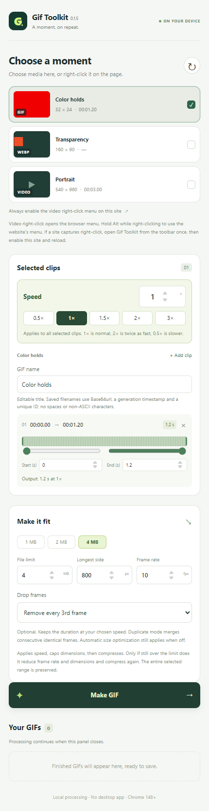

# Gif Toolkit · Chrome

**把网页上的一段画面，变成大小合适的 GIF。**

Chrome 侧栏扩展：右键选择网页视频、GIF 或 WebP，调整片段和速度，在本机生成 GIF。默认 **4 MB · 最长边 800 px · 10 fps**，无需安装桌面软件或转码服务。

[English](README.en.md) · [下载 v0.1.11](https://github.com/CarGuo/gif-chrome-plugin/releases/tag/v0.1.11) · [使用指南](docs/USER_GUIDE.md) · [更新记录](CHANGELOG.md) · [反馈问题](https://github.com/CarGuo/gif-chrome-plugin/issues)

> **当前已发布版本为 v0.1.11，要求 Chrome 148+。** 通过开发者模式安装，尚未上架 Chrome Web Store。普通网页视频、GIF / WebP 已经过端到端验证；X、YouTube 等平台的验证边界见下文。

## 功能

- **右键开始**：选中对应媒体并打开侧栏，也可通过工具栏扫描当前页面。
- **选素材、选片段**：支持多个素材、同一素材的多个时间段，每段分别生成 GIF；默认选择全部时长。
- **调整速度**：0.1–10×，提供常用倍速按钮，实时显示预计成品时长。
- **控制大小**：1 / 2 / 4 MB 预设及自定义上限；宽高都不超过 800 像素，等比例缩放。
- **按尺寸下载**：多档视频优先选不超过设置上限的最大档；完整选区以下载文件的实际结尾为准，不依赖网页播放器的近似时长。
- **可选丢帧**：默认关闭；移除连续重复帧，或每 2 / 3 / 4 帧移除一帧，保持倍速后的总时长。
- **生成后继续处理**：后台队列、取消、成品预览和重新调整。结果列表独立滚动，支持逐项保存、勾选后保存和保存全部。
- **历史与清理**：独立历史页，支持搜索、筛选和打开来源；查看 GIF 占用，清理文件并保留记录，或清空历史。
- **稳定命名**：同页重复素材标题自动加序号，可编辑显示名称；文件名采用 Base64url、生成时间戳和唯一编号，不含中文或空格。
- **本机处理**：编码器随扩展打包，提供简体中文 / 英文界面。

<details>
<summary>查看侧栏界面（自生成测试素材）</summary>



</details>

## 安装

1. 在 [Release](https://github.com/CarGuo/gif-chrome-plugin/releases/tag/v0.1.11) 下载 **`gif-toolkit-chrome-0.1.11.zip`**，解压到一个固定目录。
2. 打开 `chrome://extensions`，启用右上角「开发者模式」。
3. 点击「加载已解压的扩展程序」，选择解压后**包含 `manifest.json` 的目录**。
4. 将 Gif Toolkit 固定到 Chrome 工具栏。

GitHub 自动提供的 “Source code” 是开发源码，不能直接作为已构建扩展加载。想自己编译，请看 [开发指南](docs/DEVELOPMENT.md)。

**升级**：将新版本解压到原扩展目录，在扩展管理页点击重载，刷新来源网页并重新打开侧栏，确认左上角版本与所安装的包一致（当前源码构建为 **0.1.11**）。不要删除扩展再安装，以免清除原有本地历史。

## 三步生成

1. **选择画面**：打开网页并让视频显示画面，在媒体上右键 →「生成 GIF…」。
2. **调整片段**：默认选全部时长，可设置起止时间、添加片段；在「已选片段」顶部修改速度。
3. **生成并保存**：按需修改文件上限、最长边、帧率和丢帧，点击生成，完成后预览或保存。

### X / YouTube 右键被播放器拦截

先点击工具栏的 Gif Toolkit，再在侧栏选择「为此网站启用视频发现与右键菜单」并刷新网页。这个按钮仅申请当前网站权限。跨域内嵌播放器会单独提示「读取内嵌视频」；HLS/DASH 的跨 CDN 下载会在生成时申请 HTTP/HTTPS 来源权限。以后在媒体区域右键使用浏览器菜单，按 **Alt + 右键** 保留网站原菜单。

GIF / WebP 可先点击「读取动图，选择片段」。来自图片 CDN 的资源可能需要单独授予来源权限。

## 压缩顺序

```text
下载完整媒体 → 建立倍速后的时间轴 → 小样本估算尺寸 → 等比例缩小
    → 调色板 / GIF 编码 → Gifsicle 优化 → 检查实际字节数
    → 必要时按实测体积修正尺寸；达到尺寸和优化下限后才自动降帧
```

不通过截短选区满足体积目标。所有尝试仍超限时会明确报错，不会把超限文件标记为成功。

显式选择的丢帧模式在尺寸调整和优化后执行；关闭时，只有尺寸和优化仍无法满足上限，才会自动降帧。4 MB 按 **4,000,000 字节**计算。详细参数、文件命名和常见问题见 [使用指南](docs/USER_GUIDE.md)。

## 支持范围

| 场景 | 当前验证情况 |
| --- | --- |
| 普通横屏 / 竖屏视频，多个素材与片段 | 本地真实 Chromium 端到端通过 |
| GIF、动态 WebP、透明 WebP | 真实转换及成品解码通过 |
| 默认全时长、10 fps、倍速、丢帧、体积和尺寸约束 | UI、编码结果与历史恢复验证通过 |
| YouTube 普通视频 | SABR 下载已接入，**完整下载验收尚未通过**；旧版本的页面取帧结果不代表下载能力 |
| X 视频 / 动图 | 新增公开帖媒体解析与完整 MP4 下载，按海报匹配所选视频；**真实登录态完整流程仍待验收** |
| HLS（TS / fMP4）、DASH、文件 Blob | 完整下载与转 GIF 回归通过；无页面拖动 |
| OpenAI 页面内 Vimeo 视频 | 指定页面对应的 49.07 秒视频，真实 iframe 来源下载与转换通过 |
| YouTube Shorts、复杂信息流 | 仍待专项验收 |

### 当前限制

- 单段调速后最多 **600 个采样帧**：默认 10 fps 约 60 秒成品；2× 可覆盖约 120 秒原片。超出预算会提示调整参数。
- 下载的原始媒体最多 128 MiB，采样 PNG 总量最多 160 MiB，队列最多 24 个任务，保留最近 30 个已结束任务。
- 所有视频先取得本地媒体数据。直链、文件 Blob、HLS、DASH 和平台解析器共用后续处理流程，不再使用网页逐帧抓取。下载会话建立前请保持来源页面打开；多个无法自动关联的流需明确选择。
- 不支持 DRM、直播及无法取得完整媒体的来源。尚不包含片段拼接、画面裁剪、原视频单独导出、原片段独立预览或真实缩略图帧条。

## 隐私与权限

没有账号系统、统计上报或转码服务器；媒体画面和成品在本机处理。下载视频和 GIF / WebP 时会直接请求素材原站，可能携带该来源已有的登录凭据。X 公开帖还会请求其公开嵌入媒体接口和视频 CDN，所需来源权限在点击生成时申请。已授权网站的访问权可在 Chrome 扩展设置撤销。

本地历史包含媒体标题、来源链接、导出参数及 GIF 文件。历史页可清理 GIF 缓存并保留记录；删除任务 / 清空历史会删除对应记录与成品。已下载到磁盘的文件由用户管理。详见 [隐私和权限说明](docs/PRIVACY.md)。

## 开发

需要 Node.js 20.18+、npm，以及测试用的 Chromium 148+。

```sh
git clone git@github.com:CarGuo/gif-chrome-plugin.git
cd gif-chrome-plugin
npm ci
npm run check
npx playwright install chromium
npm run test:e2e
npm run test:drop-frames
```

加载构建生成的 `dist/`。本地开发、构建和使用扩展均**不需要 `.env` 或 GitHub token**。

[CI and Release](https://github.com/CarGuo/gif-chrome-plugin/actions/workflows/ci.yml) 在 PR 和 `main` 提交时运行类型检查、单元/浏览器测试及打包校验。推送与项目版本一致的 `vX.Y.Z` tag 后，自动发布正式 Release，包含扩展 ZIP、第三方源码 ZIP 和 SHA-256；`0.x` 同样适用。操作步骤见 [发布指南](docs/RELEASING.md)。

## 文档

| 文档 | 内容 |
| --- | --- |
| [使用指南](docs/USER_GUIDE.md) | 安装升级、倍速、丢帧、命名、错误处理 |
| [开发指南](docs/DEVELOPMENT.md) | 项目结构、处理架构、测试、贡献约定 |
| [隐私与权限](docs/PRIVACY.md) | 数据去向、存储、网络与各项权限 |
| [发布指南](docs/RELEASING.md) | 构建、源码附件、校验文件和 Release 步骤 |
| [版本记录](CHANGELOG.md) | 变更、原因、验证和剩余事项 |
| [v0.1.7 媒体验收](docs/MEDIA-0.1.7.md) | 完整下载流程、OpenAI / Vimeo 实测与 YouTube 未通过项 |
| [v0.1.8 下载与完整选区修复](docs/DOWNLOAD-0.1.8.md) | 下载尺寸上限、实际文件元数据与 X 回归 |
| [v0.1.9 历史与缓存](docs/HISTORY-0.1.9.md) | 历史入口、清理范围、存储与并发验证 |
| [v0.1.4 Review](docs/REVIEW-0.1.4.md) | 该版本的功能审查和证据边界 |
| [原始规划](docs/功能规划.md) | 历史设计记录，不代表当前功能承诺 |

## 许可证与参考

项目使用 [GPL-2.0-or-later](LICENSE)。第三方组件保留各自许可；Release 附带编码器及其依赖的源码归档、构建依据和许可证，见 [第三方说明](THIRD_PARTY_NOTICES.md)。

产品方向参考 [Gif Toolkit 桌面项目](https://github.com/CarGuo/gif-toolkit)。视频解码使用 [Mediabunny / WebCodecs](https://mediabunny.dev/)，GIF 优化使用 [Gifsicle](https://www.lcdf.org/gifsicle/)，调色板和编码使用 [FFmpeg.wasm](https://github.com/ffmpegwasm/ffmpeg.wasm)，GIF 结构校验使用 [gifuct-js](https://github.com/matt-way/gifuct-js)。
