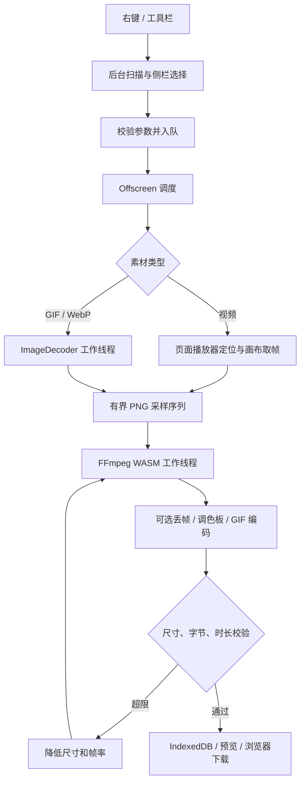

# 开发指南

[返回 README](../README.md)

## 环境和命令

- Node.js **20.18+**、npm。
- 扩展运行要求 Chrome **148+**：使用 `message_serialization: structured_clone` 传递帧 Blob。
- 构建无需桌面 FFmpeg、Python、GitHub token 或 `.env`。
- 浏览器测试使用 Playwright 自己的隔离配置，不复用开发者的登录会话。

```sh
npm ci
npm run check
npx playwright install chromium
```

将 `dist/` 加载为已解压的扩展。修改代码后重新构建，重载扩展并刷新媒体来源页。

| 命令 | 范围 |
| --- | --- |
| `npm run typecheck` | TypeScript 检查 |
| `npm test` | 默认值、范围、迁移、命名、帧计划、输出校验等契约 |
| `npm run build` | UI、后台、内容脚本、工作线程和本地编码器 |
| `npm run check` | 类型检查 + 单元测试 + 生产构建 |
| `npm run test:e2e` | 本地多素材 / 多片段、视频 / 动图、速度、预算、透明、取消、队列等 |
| `npm run test:drop-frames` | 丢帧 UI 到成品；独立检查颜色、帧数、延时、透明与超限再压缩 |
| `npm run test:preferences` | 旧 12→10 迁移、自选值保留、命名、历史界面同步 |
| `npm run test:context-menu` | 媒体、遮罩、普通控件、Alt 和刷新后的右键行为 |
| `npm run test:download` | 浏览器默认下载及实际文件名 / 字节验证 |
| `npm run test:platform` | 单独访问公开 YouTube 样片；需要网络，可能受站点状态影响 |
| `npm run package` | 生成含许可和源码索引的扩展 ZIP |
| `npm run package:sources` | 下载、校验并打包固定版本的第三方源码 |
| `npm run release:verify` | 检查 Release 包、源码附件、版本、许可及校验和 |

`tests/fixtures/` 为自生成素材。`test-results/`、构建物和源码归档不入 Git；它们可在本机重新生成。测试用 host permissions 仅写入测试副本，生产清单继续使用按需授权。

## 模块

```text
src/
  background.ts          菜单、站点权限、扫描、消息校验、任务入口
  content.ts             媒体定位、右键目标、播放器取帧和恢复
  offscreen.ts           任务队列、资源预算、编码调度和成品保存
  image-worker.ts        GIF / WebP 元数据、动画合成与取帧
  shared/
    model.ts             默认值、资源策略、参数和范围校验
    encoding.ts          压缩候选、FFmpeg 参数、GIF 成品验证
    frame-plan.ts        帧摘要解析、选择与尾帧延时
    filename.ts          统一的可保存文件名
    preferences.ts       向后兼容的设置迁移
    sources.ts           来源身份、动画元数据与片段初始化
    storage.ts           IndexedDB 历史与 Blob
  ui/                    React 侧栏、交互、Chrome i18n 封装
  locales/               英文 / 简体中文资源
```

## 处理架构



DOM 播放器操作必须在页面中执行；图片解码、帧摘要、调色板和编码在工作线程执行。Offscreen 页面按队列顺序处理，避免同时占用同一播放器或多个大型 WASM 实例。侧栏关闭不终止队列。

## 必须保持的约定

1. 默认完整选区、4,000,000 字节、800 px、10 fps、1×，额外丢帧关闭。
2. 速度在采样时映射到源时间；不依赖修改页面 `playbackRate` 伪造速度。
3. 所有压缩尝试使用同一份原始采样帧；不截短选区，不以已量化 GIF 反复转码。
4. 动画时间使用整数微秒，GIF 成品使用百分之一秒；丢帧保留 PTS 并显式设置最后延时。
5. 调色板统计完整保留画面，避免差分统计遗漏末尾新颜色。生成调色板和编码分两遍执行，控制未压缩帧的工作集。
6. 来源身份包含页面 / 文档 / 媒体属性；复用节点或导航后拒绝旧任务，不猜测替代媒体。
7. 设置与历史需向后兼容；未知枚举和无效范围明确拒绝，不能用默认值掩盖损坏数据。
8. 所有用户可见文本进入 `src/locales/`；中英文键及占位符契约由测试检查。
9. 下载、预览和历史迁移共用命名函数；不能把显示标题直接当文件路径。
10. 修改时保留版本注释、问题原因和能暴露原问题的验证，不为测试修改产品约定。

## 贡献和剩余工作

提交应聚焦一个问题，说明具体触发条件、最终行为和验证范围。新增 UI、编码路径或参数需要同步文案、迁移和文档；不要顺带更换无关依赖。

下一批独立工作包括：真实登录态 X 完整验收、Shorts / iframe 专项、源片段预览与真实缩略图帧条、超过 600 帧的资源方案、性能基线、商店图标和发布材料。不要把历史规划中的备选方案当作已实现能力。
