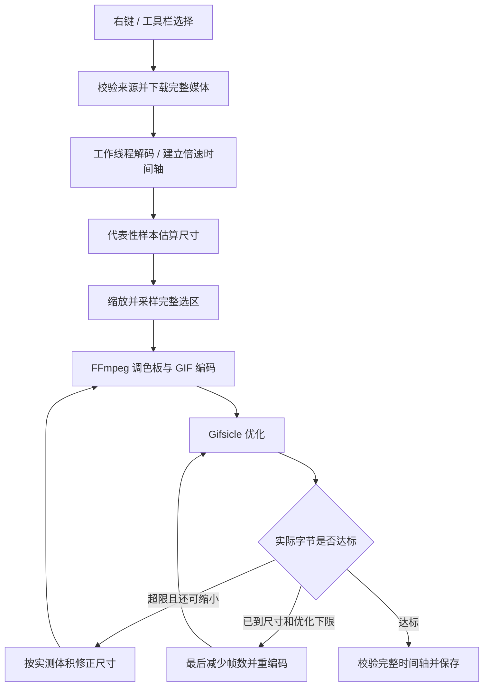

# 开发指南

[返回 README](../README.md)

## 环境和命令

- Node.js **20.18+**、npm。
- 扩展运行要求 Chrome **148+**：使用 `message_serialization: structured_clone` 传递帧 Blob。
- 构建无需桌面 FFmpeg、Python、GitHub token 或 `.env`。
- 浏览器测试使用 Playwright 自己的隔离配置，不复用开发者的登录会话。

```sh
npm ci
npm run check
npx playwright install chromium
```

将 `dist/` 加载为已解压的扩展。修改代码后重新构建，重载扩展并刷新媒体来源页。

| 命令 | 范围 |
| --- | --- |
| `npm run typecheck` | TypeScript 检查 |
| `npm test` | 默认值、范围、迁移、命名、帧计划、输出校验等契约 |
| `npm run build` | UI、后台、内容脚本、工作线程和本地编码器 |
| `npm run check` | 类型检查 + 单元测试 + 生产构建 |
| `npm run test:e2e` | 本地多素材 / 多片段、视频 / 动图、速度、预算、透明、取消、队列等 |
| `npm run test:drop-frames` | 丢帧 UI 到成品；独立检查颜色、帧数、延时、透明与超限再压缩 |
| `npm run test:preferences` | 旧 12→10 迁移、自选值保留、命名、历史界面同步 |
| `npm run test:history` | 历史查询、真实 IndexedDB 清理、跨面板预览释放、下载保留、并发任务及浏览器重启 |
| `npm run test:context-menu` | 媒体、遮罩、普通控件、Alt 和刷新后的右键行为 |
| `npm run test:download` | 浏览器默认下载及实际文件名 / 字节验证 |
| `npm run test:transports` | HLS TS / fMP4、DASH、文件 Blob 全下载转换与零页面拖动 |
| `npm run test:platform` / `test:vimeo` | 真实公开视频来源，下载完整性及短片段转换；需要网络 |
| `npm run package` | 生成含许可和源码索引的扩展 ZIP |
| `npm run package:sources` | 下载、校验并打包固定版本的第三方源码 |
| `npm run release:verify` | 检查 Release 包、源码附件、版本、许可及校验和 |

`tests/fixtures/` 为自生成素材。`test-results/`、构建物和源码归档不入 Git；它们可在本机重新生成。测试用 host permissions 仅写入测试副本，生产清单继续使用按需授权。

## CI

[工作流](../.github/workflows/ci.yml) 在 PR、`main` 推送和 `v*` tag 推送时运行，也可从 Actions 手动运行检查。使用 Ubuntu 24.04、Node.js 22 和锁定依赖对应的 Playwright Chromium；测试走已有的 `channel: chromium` 无头扩展路径。

流程为版本检查 → `npm ci` → `check` → 安装 Chromium / 系统依赖 → `test:e2e` → `test:download` → `test:drop-frames` → `test:preferences` → `test:context-menu` → 三个发行附件的打包与校验。下载测试依赖前面的真实 GIF 成品，不能单独提前或并行运行。任何一步失败都会阻止发布；可用的测试 JSON / PNG 保留 7 天。真实登录态 X 和联网 YouTube 验收仍按发布指南手工执行。

只有 tag 推送在检查成功后进入独立发布作业，该作业取得 `contents: write`，其余作业仅有读取权限。手动运行 CI 不发布。完整发布、重跑和预览版规则见 [发布指南](RELEASING.md)。

## 模块

```text
src/
  background.ts          菜单、站点权限、扫描、消息校验、任务入口
  content.ts             媒体定位、右键目标、播放器取帧和恢复
  offscreen.ts           任务队列、资源预算、编码调度和成品保存
  image-worker.ts        GIF / WebP 元数据、动画合成与取帧
  video-worker.ts        Mediabunny / WebCodecs 下载视频解码
  worker-client.ts       工作线程生命周期、可取消的 Gifsicle 优化
  shared/
    model.ts             默认值、资源策略、参数和范围校验
    acquisition.ts       下载路径、X 公开媒体身份、来源权限
    download.ts          有界可取消下载与公开媒体解析
    fit.ts               时间轴抽样、尺寸估算、实测反馈和最后降帧
    encoding.ts          FFmpeg 参数、GIF 成品验证
    frame-plan.ts        帧摘要解析、选择与尾帧延时
    filename.ts          统一的可保存文件名
    preferences.ts       向后兼容的设置迁移
    sources.ts           来源身份、动画元数据与片段初始化
    storage.ts           IndexedDB 历史与 Blob
  ui/                    React 侧栏、交互、Chrome i18n 封装
  locales/               英文 / 简体中文资源
```

## 处理架构



下载的视频由 Mediabunny / WebCodecs 在 Worker 解码，图片解码、帧摘要、调色板、GIF 编码和 Gifsicle 优化也在 Worker 执行。0.1.7 删除页面取帧路径。`download-worker.ts` 负责 HLS/DASH 解复用、合并和 SABR 协议处理；`page-observer.js` 在 MAIN 观察媒体请求元数据，识别 MSE、文件 Blob 与播放器会话。跨域内嵌播放器需先取得对应 frame 的访问权。Offscreen 页面按队列顺序处理，避免同时创建多个大型 WASM 实例。侧栏关闭不终止队列。

## 必须保持的约定

1. 默认完整选区、4,000,000 字节、800 px、10 fps、1×，额外丢帧关闭。
2. 速度在采样时映射到源时间；不依赖修改页面 `playbackRate` 伪造速度。
3. 所有压缩尝试使用同一份原始采样帧；不截短选区，不以已量化 GIF 反复转码。
4. 动画时间使用整数微秒，GIF 成品使用百分之一秒；丢帧保留 PTS 并显式设置最后延时。
5. 调色板统计完整保留画面，避免差分统计遗漏末尾新颜色。生成调色板和编码分两遍执行，控制未压缩帧的工作集。
6. 来源身份包含页面 / 文档 / 媒体属性；复用节点或导航后拒绝旧任务，不猜测替代媒体。
7. 设置与历史需向后兼容；未知枚举和无效范围明确拒绝，不能用默认值掩盖损坏数据。
8. 所有用户可见文本进入 `src/locales/`；中英文键及占位符契约由测试检查。
9. 下载、预览和历史迁移共用命名函数；不能把显示标题直接当文件路径。
10. 修改时保留版本注释、问题原因和能暴露原问题的验证，不为测试修改产品约定。
11. `Segment.endMode = source` 表示直到下载文件结尾，`end` 在下载前只是预览值；`time` 表示固定结束秒数。实际处理必须使用文件元数据解析完整选区并检查帧数，不能直接校验网页估计时长，也不能钳制用户指定的范围。
12. 多档下载共用 `chooseVideoSize`：最长边不超过上限的最大档；全部超限才取最小原档。不得用页面尺寸或原始上传尺寸冒充具体档位尺寸，不得默认挑最高码率。
13. 清理区分 GIF 文件与任务记录；`result.clearedAt` 表示文件不再保留，历史指标仍有效。删除及标记用跨 `jobs/results` 的单个事务，只处理确认的 ID 并重新检查终态。下载 URL 由每次下载独立持有，不能随历史删除提前撤销。

## 贡献和剩余工作

提交应聚焦一个问题，说明具体触发条件、最终行为和验证范围。新增 UI、编码路径或参数需要同步文案、迁移和文档；不要顺带更换无关依赖。

下一批独立工作包括：真实登录态 X 完整验收、Shorts / iframe 专项、源片段预览与真实缩略图帧条、超过 600 帧的资源方案、商店图标和发布材料。不要把历史规划中的备选方案当作已实现能力。

## 性能复测（0.1.6）

`node scripts/benchmark.mjs /absolute/path/video.mp4 --speed 5` 在独立 Chromium 扩展配置中处理完整视频，输出每阶段耗时、实测尺寸、字节、帧数和成品到 `test-results/benchmark/`。加 `--channel chrome` 可使用本机 Chrome 的独立临时配置。可加 `--x-post URL --poster URL` 验证真实公开解析接口与 CDN 下载；该模式使用受控播放器，不能替代真实登录态页面验收。性能对照必须使用相同输入、设置、浏览器和运行条件，避免把普通标签页执行与 offscreen 扩展执行混为一谈。实测结果和边界见 [0.1.6 性能记录](PERFORMANCE-0.1.6.md)。

0.1.8 可用 fMP4 输入加 `--page-duration SECONDS` 构造真实 MSE 播放器，模拟与下载文件不同的播放时长；`--mime` 可指定 SourceBuffer MIME / codec。报告分别记录网页时长与下载文件时长，成品以文件时长验证。`test:transports` 包含无需网络的同类回归夹具。
