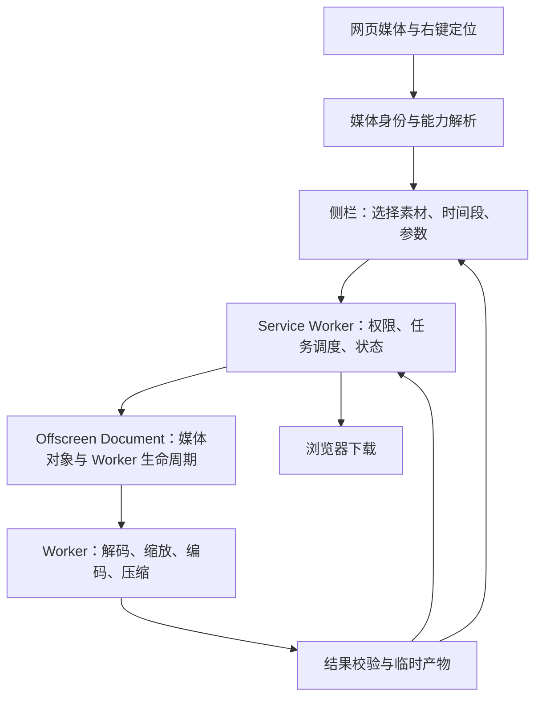

# Chrome 网页媒体转 GIF：功能规划

版本：v0.1 · 2026-09-15
状态：原始需求规划记录。后续已按纯插件、多个片段分别输出的方向实现 0.1.0 测试版；最新实施状态和已知缺口以 [README](../README.md) 与 [CHANGELOG](../CHANGELOG.md) 为准。下文的 P0 表示完整第一版目标，不代表测试版已经全部完成。

## 一、直接执行

### 1. 产品目标与当前决策

在当前网页对视频、GIF、WebP 右键，选择需要的视频与时间段，快速生成满足体积、尺寸限制的 GIF。

主流程：**右键媒体 → 选择素材和片段 → 设置体积 / 尺寸 → 生成 → 预览、下载。**

已经明确的要求：

- Chrome 插件；直接处理当前网页里的媒体。
- 视频、GIF、WebP 为输入，GIF 为第一版输出。
- X 视频与 YouTube 视频属于第一版核心验收范围。
- 可以选择页面中的多个视频，也可以选择视频内的多个时间段。
- 文件体积默认上限 4 M；宽、高都不能超过 800 像素。
- 主要入口为对应媒体上的右键菜单。

尚未确认的产品决策，不能当成用户已经选择：

| 决策 | 当前规划假设 | 对方案的影响 |
|---|---|---|
| 是否依赖桌面软件 | 先按独立插件设计，同时列出连接 Gif Toolkit 的备选架构 | 决定视频获取、编码速度、安装步骤 |
| 多段输出形式 | 每个所选时间段分别生成一个 GIF | 若需要拼接，必须增加顺序、画布和总预算定义 |
| 分发方式 | 先通过开发者模式做内部验证 | 商店发布还需评估实际功能及分发规则 |
| “4 M”的单位 | 建议显示为 4 MB，按 4,000,000 字节验收 | 现有工具使用 4 × 1024 × 1024，不能混用显示和判断单位 |

本轮只规划功能。桌面项目保持只读；依赖架构未确定前不开始对应实现。

### 2. 第一版功能清单

P0 表示第一版必须通过验收；P1 为下一轮候选，不自动纳入本轮。

| 模块 | P0 功能 | 行为说明 |
|---|---|---|
| 入口 | 媒体右键“生成 GIF…” | 直接选中对应媒体并打开侧栏 |
| 页面选择 | 当前页面媒体列表 | 多媒体时展示缩略图、类型、时长、尺寸；支持多选 |
| 普通网页 | 视频 / GIF / 动态 WebP | 识别真实类型，不能只判断 URL 后缀 |
| X | 帖子、信息流中的视频与动图 | 将用户看到的动图按实际视频资源处理；同帖多媒体分别选择 |
| YouTube | 普通视频与 Shorts | 定位当前内容与时间点，支持选择时间段；具体获取方式先验证 |
| 片段 | 时间轴双把手、时间输入、添加 / 删除片段 | 一段对应一个输出；显示各段起止时间及预计时长 |
| 尺寸 | 长边上限、实际宽高显示 | 等比例缩放；宽高分别受 800 限制；小素材不放大 |
| 体积 | 目标上限、自动压缩 | 默认 4 MB，可选择 1 / 2 / 4 MB 或自定义 |
| 预览 | 原片段预览与最终 GIF 预览 | 估算值与最终实测值明确区分 |
| 任务 | 队列、分阶段进度、取消、失败原因 | 一条失败不影响其他任务；只允许重试可重试的失败 |
| 下载 | 单个保存、保存全部已完成结果 | 文件名包含来源及时间段；支持重新调整参数生成 |
| 状态 | 最近任务与参数记忆 | 关闭侧栏后可重新查看任务，缓存有容量管理 |
| 多语言 | 简体中文、英文 | 菜单、设置、错误、进度均使用资源键和参数化文本 |

静态 WebP：明确标记为静态图片；若用户选择，可生成单帧 GIF，不制造不存在的动画。

P1 候选：多个片段拼接、画面裁剪、速度调整、额外输出格式。第一版不扩展为完整 GIF 工具箱，不引入图床上传、账号或云端转码。

### 3. 交互流程

#### 3.1 右键入口

- 视频：`生成 GIF…`。
- GIF / WebP 图片：`生成 / 压缩 GIF…`。
- 页面空白或播放器外壳：`选择本页媒体生成 GIF…`，进入候选列表。
- 插件工具栏图标打开同一侧栏，也用于播放器拦截系统右键菜单时的操作入口。
- 不接管网页全部右键行为；YouTube 等自定义播放器是否能直接显示 Chrome 菜单必须实测。

Chrome 的右键事件提供媒体类型、来源 URL、frame 等信息，但不是视频解析接口。侧栏可以由右键交互打开，适合作为持续编辑界面。[右键 API](https://developer.chrome.com/docs/extensions/reference/api/contextMenus)、[侧栏 API](https://developer.chrome.com/docs/extensions/reference/api/sidePanel)

#### 3.2 选择素材

打开侧栏立即显示已知目标，其他候选逐步补齐。当前右键素材置顶并选中，其他素材默认不选。

- 不同清晰度 / 编码属于同一媒体卡片的版本，不重复展示成多个视频。
- HLS / DASH 的下载分片是内部数据，不是用户可选的内容片段。
- 多个视频分别显示来源位置、缩略图和状态；仅发现 URL 时显示“正在确认”，不冒充可转换。
- 页面尚未加载的媒体不承诺全部发现；说明“当前已发现”，播放或加载更多后可以更新。
- 广告和正文归属不能确认时保留候选供用户选，不凭尺寸阈值误删真实素材。

#### 3.3 选择时间段

- 时间轴带缩略图，拖动双把手，允许输入精确起止时间。
- 视频默认建议选取当前播放位置开始的约 5 秒；接近结尾则在范围内调整，并明确显示选区。该值为待体验验证的默认值，不是时长上限。
- GIF / 动态 WebP 默认选择完整动画的一轮。
- 支持同一媒体添加多段，例如 `00:12–00:17`、`01:03–01:07`。
- 支持多选媒体分别配置片段；共用导出参数，每段可覆盖。
- 长视频可按建议长度生成可勾选分段，但不能默认下载或转换所有分段。
- 用显式起止时间保存片段，不能只保存“第 2 段”这样的索引。

#### 3.4 设置与生成

首屏只放三个主要设置：目标体积、长边上限、流畅度。其他编码参数留在内部策略或高级区。

```text
本页素材  [当前视频 ✓] [其他素材…]

预览画面
时间轴    [起点 ━━━━━ 终点]     + 添加片段
所选片段  00:12–00:17          00:33–00:36

文件上限  [4 MB]
最长边    [800 px]   输出预估 800 × 450
流畅度    [自动]

          [生成 2 个 GIF]

任务      获取素材 → 解码 → 编码压缩 → 校验
结果      3.78 MB · 640 × 360 · 5 秒  [预览] [下载]
```

### 4. 输出契约与压缩策略

#### 4.1 必须成立的结果

- 默认文件字节数 `≤ 4,000,000`；用户修改目标后，以选定的字节上限为准。
- `width ≤ 800` 且 `height ≤ 800`，同时遵守用户设置的更小上限。
- 保持比例，考虑源视频旋转方向，不默认拉伸、裁画面或放大小素材。
- 800 是上限，不保证每张都输出 800 像素；自动压缩可在已展示的策略内缩小。
- 保留用户选择的内容范围。降低帧率时调整帧延时，不能借此改变播放时长。
- GIF 没有音轨，获取及处理时只取需要的视频轨道。
- 生成后读取实际文件字节数、画布尺寸、帧数及总时长，再认定成功。

示例：1920 × 1080 → 最大 800 × 450；1080 × 1920 → 最大 450 × 800；400 × 300 保持不放大。

#### 4.2 压缩流程

1. 解析所选区间、显示尺寸、旋转、帧时间信息，先估计资源开销。
2. 获取所需区间的数据：有索引 / Range / 流清单时只取必需部分及关键帧依赖；服务器不支持时明确显示需要更多数据，不能承诺任何视频都能局部下载。
3. 尽早按目标尺寸缩放和抽帧；清晰度选择依据输出需要，避免无意义获取超高清和音频。
4. 从相同源数据评估颜色量化、帧差优化、受控有损参数；参数搜索有次数、时间、内存预算。
5. 必要时按可见的自动策略降低帧率或缩小尺寸，保留仍符合质量要求的候选。
6. 以完整成品实测是否达标。预估仅用于排序和提示，不能代替最终验证。

不默认继承桌面工具“先冲 2 MB”的软目标：这里用户明确给的是默认 4 MB，应在上限内兼顾画质和速度。也不照搬最短边 450 像素限制，否则会阻止合法的小图和长条图。

失败分为两类：

- **规格无法满足**：当前时长、质量约束与体积预算冲突，返回最接近的测量结果及调整建议；不标记完成，不偷偷缩短选区、增大上限或导出其他格式。
- **执行失败**：权限、来源失效、网络、解码器、内存等问题，返回对应原因及可采取的动作；不能靠反复盲重试掩盖核心错误。

透明 WebP → GIF 需要把半透明边缘转换为 GIF 支持的透明方式；必须提供可见预览并验证边缘、帧合成与背景处理。

### 5. 来源支持与验收边界

下表是实现目标和待验证事项，不代表已经支持。

| 来源 | 拟定路径 | 必须验证 |
|---|---|---|
| 普通 MP4 / WebM | 页面定位 → 有权限的扩展环境获取 → 区间解码 | 跨域、Range、无后缀 URL、旋转信息 |
| GIF | 获取原始字节 → 动画解码 / 优化 | 局部帧、disposal、透明、非等时帧，防黑帧残影 |
| 动态 WebP | 获取原始字节 → 动画解码 → GIF 编码 | 多帧、帧时长、blend / disposal、半透明 |
| X 视频 / 动图 | 帖子和媒体身份定位 → 对应播放器资源 / 流清单 | 信息流 DOM 复用、同帖多媒体、签名 URL、登录状态 |
| YouTube 普通视频 / Shorts | 当前视频身份与时间点 → 平台解析 / 当前播放资源 | 分片、签名、来源校验、协议变化、SPA 换视频 |
| 嵌入 iframe | 分 frame 定位并获取所需站点权限 | 外层页与播放器域名不同，跨域不能直接访问 DOM |
| Blob / MediaSource | 判断数据类型并找到真实数据取得方式 | `blob:` 字符串不视为可以跨上下文下载的媒体文件 |

首版平台支持聚焦当前可正常访问播放的普通内容。直播、受 DRM 保护的内容、付费权限突破和整站 / 播放列表下载不进入第一版。

**YouTube 是技术验证的首项。** YouTube.js 明确提供浏览器支持，但它面向内部 API；能在普通浏览器脚本运行，不等于可以直接在 MV3 中完整工作。需要验证签名处理、来源验证、下载授权和扩展 CSP。[YouTube.js](https://github.com/LuanRT/YouTube.js)、[Chrome CSP](https://developer.chrome.com/docs/extensions/reference/manifest/content-security-policy)

若采用桌面解析器，yt-dlp 也不能视为永不失效的组件。其当前文档涉及外部 JavaScript 运行时和部分场景的 PO Token，需纳入依赖管理与平台回归。[EJS](https://github.com/yt-dlp/yt-dlp/wiki/EJS)、[PO Token Guide](https://github.com/yt-dlp/yt-dlp/wiki/PO-Token-Guide)

### 6. 架构规划

#### 6.1 独立插件方案

建议采用 Manifest V3 + TypeScript + React；构建框架在实施时根据后台、Worker、WASM 打包验证结果确定。



职责约束：

- 页面脚本只做 DOM 定位、媒体信息收集和必要的播放器交互；解析、编码、压缩不占用网页 UI 主线程。
- Service Worker 负责调度，不承担长时间转码；任务状态需要持久化，因为它可能被浏览器终止。[生命周期](https://developer.chrome.com/docs/extensions/develop/concepts/service-workers/lifecycle)
- Offscreen Document 承载必要媒体对象并管理工作线程，本身不等于后台计算线程；重 CPU 工作继续移到 Worker。它的扩展 API 仅支持 runtime，下载等操作通过消息交给调度端。[Offscreen](https://developer.chrome.com/docs/extensions/reference/api/offscreen)
- 二进制数据保存在有容量限制的临时存储，消息传任务 ID、元数据和小控制消息；不把原视频转成巨型 Base64 在 UI、后台之间重复复制。
- 队列按任务估算内存与设备资源调度，不能直接搬用桌面版固定并行数；解码、获取和编码分别限流。
- 关闭侧栏不能中断编码；浏览器退出 / 扩展重载时诚实标记中断，已缓存来源允许重新生成，不承诺透明恢复正在运行的编码器。

独立插件媒体引擎先进行小规模对比验证：

| 环节 | 候选 | 决策依据 |
|---|---|---|
| 视频解码与按需读取 | WebCodecs + Mediabunny | 浏览器解码能力、区间读取、内存占用、所需格式支持 |
| GIF / WebP 动画解码 | ImageDecoder 或经验证的动画解码库 | 运行时检测格式能力、帧合成与时间信息正确性 |
| GIF 编码 | ffmpeg.wasm 编码管线等成熟实现 | 视频画质、全局调色板、抖动、编码时间 |
| 已有 GIF 优化 | Gifsicle WASM | 体积搜索、透明和局部帧语义 |

不先把多套编码器全部装进产品。验证后选择满足样片质量与速度的一套主链路，保持统一任务接口。ffmpeg.wasm 官方明确说明其速度仍落后于原生 FFmpeg，多线程还会增加资源消耗，因此不能直接承诺桌面版速度。[Mediabunny](https://github.com/Vanilagy/mediabunny)、[ImageDecoder](https://developer.mozilla.org/en-US/docs/Web/API/ImageDecoder)、[ffmpeg.wasm FAQ](https://ffmpegwasm.netlify.app/docs/faq/)

#### 6.2 媒体定位和权限必须一起设计

- 对已授权网站，在右键发生前用轻量监听记录目标元素、所属 frame、播放器身份及当前时间；处理 SPA 节点复用和导航失效。
- 首次使用且没有预先页面权限时，只能依赖 Chrome 提供的原生菜单信息及授权后的扫描；不能假设能事后还原已经发生的右键目标。无法唯一定位时让用户选候选。
- 页面权限和实际媒体 CDN 权限可能不同。获取原文件的跨域请求放在有对应权限的扩展环境，不能认为给页面脚本授予权限就消除了 CORS。[跨域请求](https://developer.chrome.com/docs/extensions/develop/concepts/network-requests)
- 网络观察只能获得开始观察后的请求，不承诺追溯安装前或授权前的视频分片；需要时明确提示播放目标片段重新获取，不自动刷新页面。
- 媒体身份与资源 URL 分离：一个媒体可有多个清晰度、清单、过期时间；不能粗暴删除签名查询参数去重。
- 站点适配器按统一接口注册，平台差异集中封装，不把 X / YouTube 判断分散到 UI 和编码器。
- 默认权限围绕 contextMenus、activeTab、scripting、sidePanel、storage、downloads、offscreen；持续站点访问和网络观察按已选择的获取路径设计。
- 所有 JS / WASM 随扩展打包；不照搬依赖 CDN 脚本的在线示例。YouTube 解析库也必须审查其动态执行行为。[远程代码规则](https://developer.chrome.com/docs/extensions/develop/migrate/remote-hosted-code)
- 初始语言包采用 `_locales/zh_CN/messages.json` 和 `_locales/en/messages.json`，菜单及 UI 共用资源键，使用 `chrome.i18n` 和 `Intl` 处理参数、数字与单位。[i18n](https://developer.chrome.com/docs/extensions/reference/api/i18n)

#### 6.3 可选的 Gif Toolkit 连接方案

如果用户允许安装桌面组件，建议插件负责定位、选择和预览，Gif Toolkit 负责解析、按段获取、编码与压缩。使用 Chrome Native Messaging 接入已安装应用，首次安装与组件检测是显式产品流程。[Native Messaging](https://developer.chrome.com/docs/extensions/develop/concepts/native-messaging)

这条路径可以复用更多原生处理能力，但要新增安装器注册、扩展身份校验、版本协商与任务协议。Native Messaging 消息有大小限制，不能把完整视频或 4 MB GIF 当作一条普通返回消息；产物由桌面端保存，预览需要单独设计受控的小数据 / 分块传输。

它是架构选择，不作为纯插件失败后偷偷启用的行为，也不默认启动未授权的本机服务。

### 7. 现有 Gif Toolkit 的复用结论

已核对 `D:/workspace/project/gif-toolkit` 中的以下实现：

| 位置 | 可借鉴内容 | 新项目需要重新定义的部分 |
|---|---|---|
| `src/shared/types/process.ts` | 参数、任务进度、默认长边 800 | 现有 2 MiB 软目标、4 MiB 硬目标、最短边 450、20 秒分段不是本插件既定需求 |
| `src/main/processor-utils.ts` | 片段规划、候选比较、压缩策略的纯函数拆分 | 抽出与 Electron / Node 无关的契约，不整体搬运运行时 |
| `src/main/processor.ts` | 编码压缩和进度阶段设计 | 原生 FFmpeg / Gifsicle / Sharp 不能直接在扩展里执行 |
| `src/main/resolver/ytdlp.ts` | 平台解析、取消、按段下载 | 当前格式选择偏向直链且排除若干流协议；插件不能据此宣称所有 YouTube 来源可用 |
| `src/renderer/components/SegmentPicker.tsx` | 分段选择交互 | 改用稳定的明确时间范围，支持任意多段 |
| `src/renderer/components/BatchSegmentModal.tsx` | 批处理前查看已选片段 | 在侧栏整合预览和选择，不照搬桌面弹窗层级 |

桌面仓库里的“必须在 Electron 主进程执行”属于其运行环境规则；新插件保留“UI 与重处理分离”的原则，映射到扩展后台和 Worker。旧代码的例外分支和常量不是新产品需求。

### 8. 开源参考

| 项目 | 参考价值 | 注意点 |
|---|---|---|
| [Cat Catch / 猫抓](https://github.com/xifangczy/cat-catch) | 页面资源列表、HLS / DASH 相关工具、资源归类 | 适合参考嗅探设计；项目标注 GPL-3.0，复制代码前核对许可 |
| [YouTube.js](https://github.com/LuanRT/YouTube.js) | 浏览器侧 YouTube 内部 API 解析 | 不等于 MV3 开箱即用，先验证平台及 CSP 条件 |
| [yt-dlp](https://github.com/yt-dlp/yt-dlp) | 桌面连接方案的平台解析和区间下载 | 需要原生运行环境，不能直接塞入浏览器扩展 |
| [Chrome 官方示例](https://github.com/GoogleChrome/chrome-extensions-samples) | 右键、侧栏、Offscreen、标签页捕获的扩展边界 | 用于验证 Chrome 行为，不替代视频解析器 |
| [Mediabunny](https://github.com/Vanilagy/mediabunny) | 浏览器媒体读取和解码 | 按实际编解码器能力验证 |
| [ffmpeg.wasm](https://ffmpegwasm.netlify.app/docs/overview/) | 本地浏览器转码与调色板编码 | 包体、内存、执行时间和 WASM CSP 必须测量 |
| [Gifsicle WASM](https://github.com/renzhezhilu/gifsicle-wasm-browser) | 浏览器内 GIF 优化 | 验证包内加载、Worker 运行与输出正确性 |
| [gifenc](https://github.com/mattdesl/gifenc) | 轻量 Worker 编码设计 | 项目说明更适合平面图形，不能只因速度快就作为视频画质方案 |

### 9. 实施顺序与完成标准

**阶段 A：验证核心不确定性。** 使用真实 Chrome 验证普通跨域视频、X 视频 / 动图、YouTube 普通视频 / Shorts、透明动态 WebP。记录来源获取方式、右键目标准确性、MV3 能否执行、耗时和峰值资源。先给出平台能力矩阵，再定最终引擎和安装架构。

**阶段 B：打通单素材。** 右键定位、侧栏选区、4 MB / 800 限制、Worker 编码、结果预览和下载。X 与 YouTube 继续作为核心验收项，不能用普通 MP4 演示代替平台支持。

**阶段 C：完成多素材与多片段。** 去重、时间段配置、任务排队、取消、失败隔离、侧栏重开、参数记忆、多语言。

**阶段 D：形成可安装版本。** 在确定的 Chrome 最低版本与当前稳定版本进行端到端验收，输出已验证 / 不支持 / 仍有条件的场景表和版本说明。

关键验收场景：

1. 一页三个视频，右键第二个，准确预选第二个；不同清晰度不会变成额外视频。
2. 同一视频选两段，再勾选另一视频一段，得到三个独立、内容正确的 GIF。
3. 横屏、竖屏、超宽图和小图均保持比例，两边都不超过 800。
4. 默认上限与自定义上限均以成品字节数验收；边界按实际字节比较，不按四舍五入后的显示判断。
5. GIF / WebP 的透明、局部帧、不等帧间隔保持正确，无黑帧、残影、错误加速。
6. 当前 X 帖子与 YouTube / Shorts 实际完成选段转换；记录验证日期和样片，不能只验“抓到了 URL”。
7. 取消后终止获取和计算、清理当前任务资源；失败不影响别的任务。
8. 关闭侧栏后任务继续，重开显示正确状态；浏览器退出后不显示虚假的完成状态。
9. URL 过期、权限不足、无 Range、空列表、损坏来源、超预算都有可操作的真实状态。
10. 分别记录冷启动与热启动、素材获取与转码时间；“快速”的数值目标以选定设备和真实样片基线确定，不在未测量前承诺几秒完成。

测试应覆盖这些外部行为；修复缺陷时保留复现场景、版本和原因，不通过放宽输出契约使测试通过。

## 二、深度交互

### 1. 核心取舍是安装体验、处理速度和平台获取能力

| 路线 | 价值 | 成本 |
|---|---|---|
| 独立插件 | 安装一个扩展即可使用，媒体留在本机 | 平台解析和浏览器编码需要单独验证、持续维护 |
| 插件 + Gif Toolkit | 复用原生处理能力和现有工程经验 | 用户需安装、连接并维护桌面组件 |

建议：若面向陌生用户推广，以独立插件体验为优先；若主要是自己的素材工作流，允许连接 Gif Toolkit 更值得优先验证。此决策影响整个实现，不能在用户未选择时默认为强制桌面依赖。

### 2. “抓取原始数据”与“录制播放画面”是两种不同产品能力

文件 / 流转 GIF 可以按索引取得任意区间，并可能快于播放速度；录制则至少要经历所选内容的实际播放时间，还会受播放器覆盖层、缓冲、页面滚动及可见范围影响。

Chrome 提供用户交互触发的标签页捕获与 Offscreen 录制机制，但这不意味着天然得到纯净的某个视频画面。[官方捕获方案](https://developer.chrome.com/docs/extensions/how-to/web-platform/screen-capture)

如果独立插件的 YouTube 原始数据获取无法达到稳定标准，需要讨论是否接受一个明确命名的“录制当前播放片段”模式。不能自动改成录屏后继续宣称原始抓取成功，也不能悄悄把 YouTube 移出第一版范围。

### 3. 体积限制不能同时保证任意时长、固定大尺寸和高画质

用户真正需要的是“可以直接使用的 GIF”。因此必须明确哪些参数可自动优化，哪些内容不可变：

- 自动模式可调整颜色、压缩强度、帧率和尺寸，并显示最终结果。
- 时间段和素材身份属于内容要求，必须保持。
- 用户锁定的尺寸 / 帧率属于额外约束；与体积冲突时明确报告，不暗中松绑。
- 默认 4 MB 是可配置的文件预算；800 是明确的宽高硬上限，两者语义不要混为一个“质量”滑块。

### 4. 多片段先明确产物，再决定是否做剪辑器

分别输出时，4 MB 是每个 GIF 的上限，选择逻辑简单。若拼成一个，4 MB 就变成整条合成动画的总预算，还需要决定排序、不同画面比例的适配及跨素材时间轴。

因此暂按分别输出规划。只有确认需要拼接后，才将画布、排序及合成预算纳入当前范围。

### 5. 分发要求会影响 YouTube 功能设计

自用加载和商店分发需要分别验收。商店版应按最终实现核对功能、权限、远程代码和内容使用要求；技术上能运行并不等于一定获准上架，也不应笼统断言所有 YouTube 相关扩展都禁止。[Chrome Web Store 政策](https://developer.chrome.com/docs/webstore/program-policies/policies)

### 6. 当前还差什么

- 用户决定：独立插件还是允许依赖 Gif Toolkit；多段分别输出还是同时需要拼接；自用还是商店分发。
- 技术验证：X / YouTube 的真实来源获取、右键定位、动态 WebP 正确性及 MV3 编码性能。
- 验证完成后：选定一个处理主链路、确定质量策略和性能目标、开始可安装插件实现。

### 版本记录

- **v0.1 / 2026-09-15**：根据原始需求、现有 Gif Toolkit 源码与 Chrome / 开源项目资料建立首版规划。记录体积单位、双轴尺寸限制、片段语义、平台获取边界及线程职责，避免后续将桌面默认值或录屏行为误当成已确认需求。
